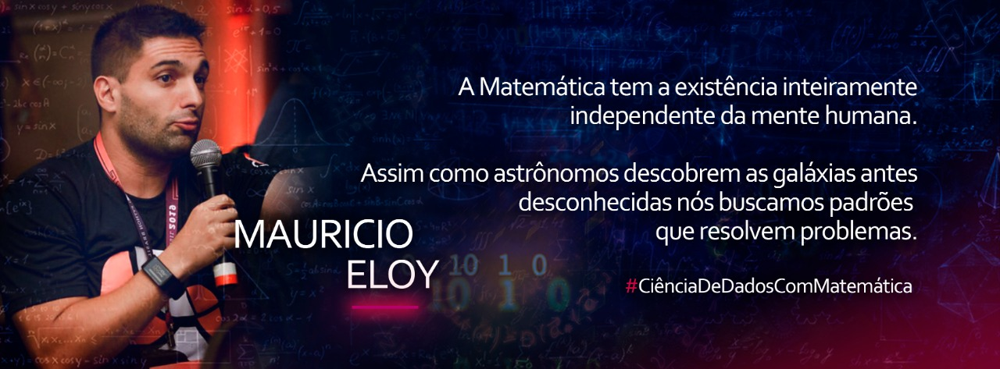

   

  

# Mauricio Eloy
*CEO | Co-Founder | Data Scientist | Mathematician | Research* at Cytrix Analytics

Sou mestre em Matemática pela UNESP - Campus de Rio Claro e atuei por mais de dez anos na área de ensino, com ênfase nas disciplinas Calculo Diferencial e Integral, Matemática Financeira, Lógica Matemática, Estatística e Probabilidade.

Nos últimos três anos comecei a minha jornada para a migração total para a área de Ciência de Dados. Participei de vários eventos voltados à Ciência de Dados e programação Python.

Atualmente divido o meu tempo entre i) as responsabilidades atreladas a startup Cytrix Analytics: criação e manutenção dos métodos matemáticos e estatísticos empregados nos algoritmos e modelos utilizados pela equipe. Também sou encarregado de compreender o negócio e o mercado ao qual os dados estão inseridos, para além de entendê-los matematicamente, contextualizá-los e interpretá-los, de modo que uma história possa ser contada com os dados e os números, Data Storytelling; e ii) aperfeiçoamento profissional através do MBA em Ciências de Dados fornecido pela USP - Campus de São Carlos.

**Background:** Python, Machine Learning, Matemática Computacional..

**Links:**

* [LinkedIn](https://www.linkedin.com/in/mauricio-eloy)

## Projetos:

Veja alguns dos projetos desenvolvidos:

* **Análise de Redes Sociais:** https://bit.ly/36H6xZB
* **Análise de Mídias Sociais e muito mais!:** https://bit.ly/3cHsYld

---
